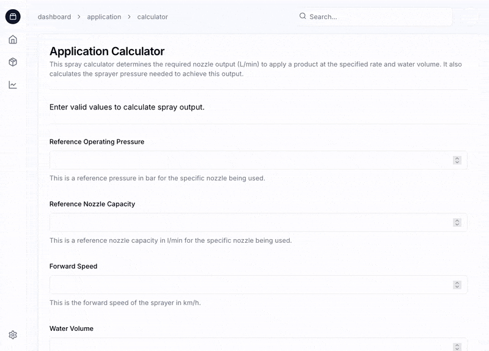

# Sprayer Calibration & Application Planning Tool

This is a web application designed to you **calibrate your sprayer** and **plan accurate your spray applications**. The tool takes inputs about your sprayer setup and the products you wish to apply and calculates the nozzle output, pressure, and tank mix details.

## Getting Started

To get started with the development server:

```bash
npm install
npm run dev
```

Open [http://localhost:3000/dashboard/application/calculator](http://localhost:3000/dashboard/application/calculator) with your browser to see the calculator.

## Demo




## About the Calculator

The application calculator is designed to make spray setup simple and accurate. After entering your inputs, the calculator provides:

- **Required nozzle output (l/min)**  
  The flow rate each nozzle must produce to apply the desired **water volume and product** at your chosen forward speed.

- **Required sprayer pressure (bar)**  
  The pressure your sprayer must be set to in order to achieve the required nozzle output, based on your reference calibration.

- **Total water and product volume needed**  
  Calculates how much total mix is required to cover the target area inluding water and product.


## How to Calibrate and Collect Inputs

Before using the calculator, you'll need to measure a few values from your own sprayer:

### 1. Measure Nozzle Output (l/min)

To determine your **reference nozzle capacity**:

- Catch the output from **one nozzle for exactly 1 minute** using a measuring jug or cylinder.
- Measure the volume in **litres** — this is your **reference nozzle capacity**.

### 2. Record Sprayer Pressure (bar)

While you measure nozzle output, **take note of the operating pressure** on the gauge.  
This is your **reference pressure** — it represents the pressure at which that flow rate was achieved.

### 3. Measure Forward Speed (km/h)

To determine how fast your sprayer moves during applications:

- Mark out a known distance (e.g. **100 metres**).
- Drive the sprayer across it at the desired spraying pace.
- Time how long it takes (in seconds).
- Calculate forward speed using: $$\text{Forward speed (km/h)} = (\text{Distance in metres} \div \text{Time in seconds}) \times 3.6$$
- Enter this as forward speed into the calculator.

### 4. Measure Nozzle Spacing (metres)

Use a tape measure to check the **distance between two adjacent nozzles** on the boom.  
Enter this as your **nozzle spacing** (e.g. `0.5`).

---

Once you've gathered all of this information, you can enter it into the calculator along with your desired **water volume (l/ha)** and **application area (hectares)**.

## Spray Drift Prevention

To minimise the risk of spray drift and ensure applications are effective and environmentally safe:

- **Only spray when wind speed is between 3–10 MPH (5–17 km/h).**
- **Avoid spraying in still conditions (below 3 MPH)**, as this can cause the spray to hang and drift unpredictably.
- **Do not apply sprays under high-risk weather conditions**, such as:
  - Temperatures exceeding **30°C (86°F)**
  - **Relative humidity below 55%**

Spraying in these conditions increases evaporation and drift, leading to product loss and reduced effectiveness. Always check weather forecasts before planning your application.